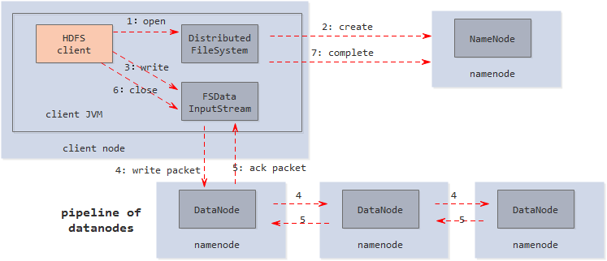

[TOC]

---

### _hadoop的组成和概述_

```java
hadoop
 它是一个分布式计算+分布式文件系统,前者其实就是MapReduce,后者是HDFS,后者可以独立运行,前者可以独立运行,前者可以选择性使用,也可以不使用

hive
    通俗的说是一个数据仓库,仓库中的数据是被hdfs管理的数据文件,它支持类似sql语句的功能,我们可以通过该语句完成分布式环境的计算功能,
    hive将语句转换为MapReduce,然后交给hadoop执行.
    这里的计算仅限于查找和分布,而不是更新,增加和删除.它的优势是对历史数据进行处理,用时下流程的说法是离线计算,因为它的底层是MapReduce
    MapReduce在实时计算上性能很差.它的做法是把数据文件加载进来作为一个Hive表(或者外部表)让我们觉得我们sql操作的是传统的表

Hbase
    通俗说,hbase的作用类似于数据库,传统数据库管理的是集中的本地数据文件,而Hbase基于HDFS实现对分布式数据文件的管理,比如增删改查.
    也就是说,Hbase只是利用Hadoop的hdfs帮助其管理数据的持久化文件(HFile),它跟MapReduce没任何关系.hbase的优势在于实时计算,所有实时数据都直接存入Hbase中,客户端通过API直接访问Hbase,实现实时计算.由于它使用的是nosql,或者说是列式结构,从而提高了查找性能,使其能运用于大数据场景,这是它和MapReduce的区别.

总结:
    hadoop是hive和habase的基础,hive依赖hadoop,而hbase仅依赖Hadoop的hdfs模块
    hive适用于离线数据的分析,操作的是通用格式(如通用的日志文件),被hadoop管理的数据文件,它支持类sql,比编写MapReduce的java来的更加方便
    hive的定位是数据仓库,存储和分析历史数据
    hbase使用于实时计算,采用列式结构的nosql,操作的是自己生成的特使格式的File,被hadoop管理的数据文件,它的定位是数据库或者叫DBMS
```

#### _hadoop目录结构分析_

```java
bin hadoop最基本的管理脚本和使用脚本所在目录,这些脚本是sbin目录下管理脚本的基础实现,用户可以直接使用这些脚本管理和使用hadoop
etc hadoop配置文件所在的目录,包括core-site.xml hdfs-site.xml mapred-site.xml 等从hadoop1.0继承来的配置文件和yarn-site.xml等hadoop2.0新增的配置文件
include 对外提供编程库头文件(具体动态库和静态库在lib目录中),这些头文件均是C++定义的,通常用于C++程序访问HDFS或者编写mapreduce
lib 该目录包含了hadoop对外提供的编程动态库和静态库与include目录中头文件结合使用
libexec 各个服务对应的shell配置文件所在的目录,可用于配置日志输出目录,启动参数(比如jvm参数)等基本信息
sbin hadoop管理脚本所在目录,主要包含HDFS和yarn中各类服务的启动和关闭脚本
share hadoop各个模块编译后的jar包所在的目录
```


### _hadoop的操作命令_

```shell
hadoop version   查看版本
hadoop fs  文件系统客户端
hadoop jar 运行jar包
hadoop classpath  查看类路径
hadoop checknative 检查本地库并压缩
hadoop distcp  远程递归拷贝文件
hadoop credentical 认证
hadoop trace 跟踪

```

 

### _hadoop的安装_


#### _hadoop的单机版安装_

```java
配置core-site.xml

配置hdfs-site.xml


hadoop数据文件格式化
	hadoop namenode -format
	格式化完毕,这种格式化hdfs的方式是需要把原来的hdfs中数据全部清空,然后在格式化并安装一个全新的hdfs
启动hdfs的命令
	切换到sbin目录下 ./start-dfs.sh

配置yarn-site.xml

	
```


### _hdfs介绍_

#### _hdfs文件系统_

```xml
hdfs 文件系统
	是一个高度容错的系统,能够检查和应对硬件故障,用于在低成本的通用硬件上运行.HDFS简化了文件的一致性模型,通过流式数据访问,提供高吞吐量应用程序数据访问功能,适合带有大量数据集的应用程序.

NameNode
	管理数据节点和文件块的映射关系,处理客户端对数据的读写请求.
	NameNode保存了两个核心的数据结构,FsImage和EditLog.FsImage用于维护文件系统树以及元数据;EditLog记录了文件的操作,NameNode不持久化Block与DataNode的映射信息,而是在系统每次启动的时候扫描所有DataNode来重构这些信息.
	Namenode内存中存储的是= fsimage+edits

DatNode
	负责数据的存储和读取,向NameNode定期发送自己的存储块信息.周期性地向NameNode发送心跳信息报告自己的状态.
HDFS集群中只有一个NameNode，负责所有元数据的管理,有若干DataNode,每个DataNode运行在一个独立节点上.

SecondaryNameNode
	对NameNode进行备份,周期性地从NameNode下载EditLog(操作日志)和FsImage(镜像文件),将EditLog和FsImage合并得到FsImage.ckpt,将合并后的FsImage.ckpt上传到NameNode,更新NameNode的EditLog与FsImage
	SecondaryNameNode负责定时默认1小时,从namenode上,获取fsimage和edits来进行合并,然后在发送给namenode,减少namenode的工作量。
```

##### _hdfs关于block的大小_

```xml
1）HDFS默认文件块Block大小为64MB,hadoop2.0后修改为128MB, 如果一个文件小于block,则它并不占整个Block空间
   块的大小可以通过配置参数(dfs.blocksize来规定)
2）Block不宜过大,MR的map任务一次只能处理一个Block数据,Block数据过大会是启动的Maps数量过少,影响并行处理速度
3）HDFS 无法高效存储大量小文件
	检索效率, hdfs中的NameNode的元数据保存在内存中，过多的小文件需要大量内存空间,降低数据检索效率
	寻址开销, 访问大量小文件,需要不断从一个DataNode调到另一个DataNode，寻址开销增大
	线程开销，MapReduce处理大量小文件时会产生过多的Map任务,线程管理开销会大大增加
```


#### _hdfs同步机制_

#### _hdfs文件的读取和写入_

##### _hdfs读取过程_


```java
1) 客户端通过调用FileSystem对象的open()来读取希望打开的文件.对于HDFS来说，这个对象时分布式文件系统的一个实例
2) DistributedFileSystem通过RPC来调用namenode，以确定文件的开头部分的块位置.对于每一个块,namenode返回具有该副本的datanode地址,此外,这些datanode根据它们与client的距离来排序(根据网络集群的拓扑)。如果该client本身就是一个datanode,便从本地datanode中读取。
	DistributedFileSystem返回一个FSDataInputStream对象给client读取数据,FSDataInputStream转而包装了一个DFSInputStream对象。
3) 接着client对这个输入流调用read().存储着文件开头部分的块数据节点的地址DFSInputStream随即与这些最近的datanode相连接
4) 通过在数据流中反复调用read()，数据会从datanode返回client
5）到达块的末端时,DFSInputStream会关闭与datanode间的联系,然后为下一个块找到最佳的datanode.
    client端只需要读取一个连续的流,这些对于client来说是透明的.
6) 在读取的时候,如果client与datanode通信时遇到一个错误,那么它就会去尝试对这个块来说最近的下一个块。
	它也会记那个故障节点的datanode，以保证不会再对之后的块进行徒劳无益的尝试.
    client 也会确认datanode发来的数据校验和,如果发现一个损坏的块,它就会在client试图从别的datanode中读取一个块的副本之前报告给namenode
7)  真个设计的一个重点是,client直接联系datanode去检索数据,并被namenode指引到块中最好的datanode。
	因为数据流在此集群中是所有datanode分散进行的。
	所以这种设计能使HDFS可扩展到最大的并发client数量,同时namenode只不过提供块的位置请求(存储在内存中,十分高效),不是提供数据.否则如果客户端数量增长,namenode就可能成为一个"瓶颈"
```

##### _hdfs写入过程_



```java
1） 客户端通过在DistributedFileSystem中调用create()来创建文件
2） DistributeFileSystem使用RPC去调用namenode，在文件系统的命名空间创建一个新的文件,没有块与之相关联
	namenode执行各种不同的检查(这个文件是否存在,有没有权限去写,能不能存的下这个文件)以确保这个文件不会已经	 存在,并且client有可以创建文件的适当许可。
	如果检查通过,namenode就会生成一个新的文件记录;否则,文件创建失败并向client抛出一个IOException异常.
    分布式文件系统返回一个文件系统数据输出流,让client开始写入数据.就像读取事件一样,文件系统数据输出流控制一	个DFSOutputStream,负责处理datanode和namenode之间的通信
3） 在client写入数据时,DFSOutputStream将它分成一个个的包,写入内部的队列,成为数据队列。
	数据队列随着数据流流动,数据流的责任是根据合适的datanode的列表要求这些节点为副本分配新的块。
	这个数据节点得列表形成一个管线-- 假设副本是3,所以有三个节点在管线中
4） 数据流将包分流给管线中第一个的datanode, 这个节点会存储存储包并且发送给管线中的第二个datanode。
	同样地,第二个datanode存储包并且传给管线中的第三个数据节点。
5)  DFSOutputStream 也有一个内部包队列来等待datanode收到确认，成为确认队列,一个包只有被管线中的所有节点确	    认后才会被移除确认队列。如果在有数据写入期间,datanode发生故障,则会执行下面的操作,当然这对写入数据的		client来说是透明的。
首先管线被关闭,确认队列中的任何包都会被添加回数据队列的前面,确保故障节点下游的datanode不会漏掉任意一个包。为存储在另一个正常datanode的当前数据块制定一个新的标识,并将标识传给namenode，以便故障节点datanode在恢复后可以删除存储的部分数据块。
从管线中删除故障数据节点并且把余下的数据块写入管线中的两个正常的datanode。namenode注意到块副本量不足时,会在另一个节点上创建一个新的副本。后续的数据块继续正常接收处理,主要dfs.replication.min的副本(默认是1)被写入,写操作就是成功的,并且这个块会在集群中被异步复制,直到其满足目标副本数(dfs.replication默认值为3)
6） client 完成数据的写入后,就会在流中调用close()
7） 在向namenode节点发送完消息之前,此方法会将余下的所有包放入datanode管线并等待确认
    namenode节点已经知道文件由哪些块组成(通过Data streamer询问块分配),所以它只需要在返回成功前等待块最小量的复制
 
副本的布局
	hadoop的默认布局策略是在运行客户端的节点上放第一个副本(如果客户端运行在集群之外,就随机选择一个节点,不过系统会避免挑选那些存储太慢或太忙的节点) 第二个副本放在与第一个副本不同且随机另外选择的机架节点上(离架)。第三个副本与第二个副本放在相同的机架,且随机选择另一个节点。其他副本放在集群中随机的节点上,不过系统会尽量避免相同的机架防止太多的副本。
```


#### _hdfs文件操作命令_

```shell
hadoop hdfs系统的一些常用命令
 操作hdfs系统可以使用hadoop fs也可以使用hdfs dfs,两者效果一样(hadoop dfs 命令已不再建议使用)
常用命令
  hadoop fs (等价于hdfs dfs)文件操作
  1) 显示目录下的所有文件或者文件夹
     >> hadoop fs -ls [uri形式目录]
        示例: hadoop fs -ls / (显示根目录下的所有文件和目录)
    [root@master ~]# hadoop fs -ls  /
    Found 2 items
    drwxr-xr-x   - root supergroup          0 2018-12-08 01:45 /mydata
    -rw-r--r--   1 root supergroup        911 2018-12-07 02:00 /root
    [root@master ~]# 
    [root@master ~]# hadoop fs -ls -R  /    --递归查看对应的文件目录
    drwxr-xr-x   - root supergroup          0 2018-12-08 01:45 /mydata
    -rw-r--r--   1 root supergroup        911 2018-12-07 20:03 /mydata/log.log
    -rw-r--r--   1 root supergroup        911 2018-12-08 01:45 /mydata/log.txt
    -rw-r--r--   1 root supergroup        911 2018-12-07 02:00 /root
    
    [root@master ~]# 
    [root@master ~]# hadoop fs -ls -R  /mydata
    -rw-r--r--   1 root supergroup        911 2018-12-07 20:03 /mydata/log.log
    -rw-r--r--   1 root supergroup        911 2018-12-08 01:45 /mydata/log.txt
  2) cat查看文件内容
     >> hadoop fs -cat URI [uri ...]
        示例: hadoop fs -cat /in/test2.txt
  3) mkdir创建目录
     >> 使用方法 hadoop fs -mkdir /test
        如果创建多级目录,加上-p
        示例: hadoop fs -mkdir -p /a/b/c
    //--使用时需要先创建目录,否则会报错--
    [root@master ~]# hadoop fs -put log.log hdfs://master.ssgao:9000/mydata/log.log
    put: `hdfs://master.ssgao:9000/mydata/log.log': No such file or directory
    [root@master ~]# hadoop fs -mkdir hdfs://master.ssgao:9000/mydata
    [root@master ~]# hadoop fs -put log.log hdfs://master.ssgao:9000/mydata/log.log
  4) rm 删除目录或者文件
     >> 使用方法 hadoop fs -rm [文件路径] 删除文件夹加上 -r
        hadoop fs -rm /test1.txt
        删除文件夹,加上-r
        hadoop fs -rm -r /test
        hadoop fs -rmr dir 删除目录dir
  5) put 复制文件
     >> 将文件复制到hdfs 系统中,也可以从标准输入中读取文件,此时的dst是一个文件
        使用方法: hadoop fs -put <localsrc>  <dst>
        示例: hadoop fs -put /usr/wisedu/temp/test1.txt  /
        从标准输入中读取文件: hadoop fs -put -/in/myword    
  6) cp 复制系统内文件
     >> 使用方法: hadoop -cp URI [URI....] <dest>
        将文件从源路径复制到目标路径,这个命令允许有多个源路径,此时目标路径必须是一个目录
        hadoop fs -cp /in/myword/word
  7) copyFromLocal复制本地文件到hdfs
     >> 使用方法: hadoop fs-copyFromLocal <localsrc> URI
        除了限定源路径是一个本地文件外,和put命令相似
  8) get复制文件到本地系统
     >> 使用方法: hadoop fs -get[-ignorecrc] [-crc] <src> <localdst>
        复制文件到本地文件系统,可用 -ignorecrc选项复制CRC校验失败的文件,使用-crc选项复制文件以及CRC信息
        hadoop fs -get /word  /usr/wisedu/temp/word.txt
        hadoop fs -get /usr/hadoop/file localfile
        hadoop fs -get hdfs://host:port/user/hadoop/file  localfile
  9) copyToLocal复制文件到本地系统
     >> 使用方法: hadoop fs -copyToLocal[-ignorecrc] [-crc] <src> <localdst>
        除了限定目标路径是一个本地文件外,和get命令类似
        hadoop fs -copyToLocal/word /usr/wisedu/temp/word.txt
  10) mv
      >> 将文件从源路径移动到目标路径, 这个命令允许有多个源路径,此时目标路径必须是一个目录,不允许在不同的文件系统间移动文件。 
      使用方法: hadoop fs -mv URI[URI...] <dest>
      示例: hadoop fs -mv /in/test2.txt /test2.txt
  11) du 显示文件大小
     >> 显示目录中所有文件的大小
        使用方法: hadoop fs -du URI[URI...]
        示例: hadoop fs -du /
              hadoop fs -du /user/hadoop/dir1 /user/hadoop/file1 hdfs://host:port/user/hadoop/dir1
        显示当前目录或者文件夹的大小可加选项 -s
     >>> dus 显示文件大小
         hadoop fs -dus <args>
[root@master sbin]# hadoop dfs -du -s -h /tmp/  --显示目录的大小
DEPRECATED: Use of this script to execute hdfs command is deprecated.
Instead use the hdfs command for it.
2.9 M  /tmp
         
  12) touchz 创建空文件
     >> 使用方法 hadoop fs -touchz URI [URI ...]
        创建一个0字节的空文件
        示例 hadoop fs -touchz /empty.txt
  13) chmod 改变文件权限
  14) chown 改变文件所有者
  15) chgrp 改变文件所在组
  *) tail 将文件尾部1k字节的内容输出到stdout
      hadoop fs -tail URI
      hadoop fs -tail pathname
  *) test 检查信息
      hadoop fs -test -[ezd] URI
      -e 检查文件是否存在,如果存在则返回0
      -z 检查文件是否是0字节,如果是则返回0
      -d 如果路径是一个目录,则返回1, 否则返回0
   *) text 将源文件输出为文本格式,允许的格式是zip和TextRecordInputStream
      hadoop fs -text <src>
   *) 清空回收站
      hadoop fs -expunge

> 查看文件系统可以使用的空间
[root@master hadoop-2.7.4]# hadoop fs -df -h /
Filesystem                  Size   Used  Available  Use%
hdfs://master.ssgao:9000  44.8 G  3.2 M     40.1 G    0%

> 上传,下载,查看文件信息
[root@master ~]# hadoop fs -put /root/log.log hdfs://master.ssgao:9000/root
[root@master ~]# hadoop fs -cat hdfs://master.ssgao:9000/root
eth0      Link encap:Ethernet  HWaddr 00:0C:29:47:3F:D4  
[root@master ~]# hadoop fs -ls /
Found 1 items
-rw-r--r--   1 root supergroup        911 2018-12-07 02:00 /root
[root@master ~]# hadoop fs -get /root log.log
[root@master ~]# hadoop fs -get hdfs://master.ssgao:9000/root log1.log
```

```shell
1) -help[cmd] 显示命令的帮助信息
   ./hdfs dfs -help ls
2) -ls(r) 显示当前目录下的所有文件,-R层层循出文件夹
   ./hdfs dfs -ls /log/map
   ./hdfs dfs -lsr /log/ (递归)
   'hadoop 没有当前目录的概念,也没有cd命令,所以在列出文件下的所有文件的时候,需要指定全路径名' 
   [root@master bin]# hdfs dfs -ls /
   Found 1 items
   -rw-r--r--   1 root supergroup        911 2018-12-07 02:00 /root
3) -du(s)显示目录中所有文件大小,或者当只指定一个文件时,显示此文件的大小
   ./hdfs dfs -du /usr/hadoop/dir1 /usr/hadoop/file1 hdfs://host:port/usr/hadoop/dir1
4) -count[-q]显示当前目录下所有文件的大小
5) -mv移动多个文件目录到目标目录
   ./hdfs dfs -mv /usr/hadoop/file1 /usr/hadoop/file2
6) -cp复制多个文件到目录
   ./hdfs dfs -cp /usr/hadoop/file1 /usr/hadoop/file2
   (将文件从源路径复制到目标路径,这个命令有多个源路径,此时目标路径必须是一个目录)
7) -rm(r) 删除文件(夹)
   ./hdfs dfs -rmr /log/map1 (递归删除)
8) -put本地文件复制到hdfs(上传本地文件)
   ./hdfs dfs -put test.txt /log/map/
9) -copyFromLocal 本地文件复制到hdfs
   ./hdfs dfs -copyFromLocal /usr/data/text.txt /log/map1/ 
   (将本地的text.txt 复制到hdfs的/log/map1/下)
10) -moveFromLocal 本地文件移动到hdfs
    ./hdfs dfs -moveFromLocal /usr/data/text.txt /log/map1/
    (将本地的text.txt移动到hdfs的/log/map1/下)
11) -get[-ignoreCrc]复制文件到本地,可以忽略crc校验
    ./hdfs dfs -get /log/map1/* .
    (复制到本地当前目录下)
    ./hdfs dfs -get /log/map1/* /usr/data
    (将hdfs下的/log/map1/下的所有文件全部复制到本地的/usr/data/下)
12) -cat在终端显示文件内容
    ./hdfs dfs -cat /log/map1/part-0000 |head
    (读取hdfs上的/log/map1下的part-0000文件, head参数,代表前10行)
    /hdfs dfs -tail /log/map1/part-0000
    (查看文件的最后一行)

13) -text在终端显示文件内容,将源文件输出为文件格式。
    允许的格式为 zip和TextRecordInputStream
14) -copyToLocal[-ignoreCrc] 复制文件到本地
15) -moveToLocal 移动文件到本地
16) -mkdir 创建文件夹,后跟-p可以创建不存在的父路径
    ./hdfs dfs -mkdir -p /dir1/dir11/dir111
17) -touchz 创建一个空文件
18) -grep 从hdfs上过滤包含某个字符的行内容 (cat 查看文件信息)
    ./hdfs dfs -cat /log/testlog/* | grep 过滤字段
查看HDFS的统计信息
    hdfs dfsadmin -report
```

#### _FileSystem API_

```java
主要命名空间
    org.apache.hadoop.conf.Configuration
    org.apache.hadoop.fs.FileSystem
    org.apache.hadoop.fs.Path
    org.apache.hadoop.fs.FSDataInputStream;
    org.apache.hadoop.fs.FSDataOutputStream;
初始化对象
    Configuration
    FileSystem hdfs
创建文件
    FSDataOutputStream = hdfs.create(path);
    FSDataOutputStream.write(buffer,0,buffer.length)
创建文件夹
    hdfs.mkdirs(Path)
读文件
    FSDataInputStream = hdfs.open(path);
    FSDataInputStream.read(buffer)
写文件
    FSDataOutputStream = hdfs.append(path)
    FSDataOutputStream.write(buffer,0,buffer.length);
删除文件
    FileSystem.delete(path);
列出文件夹内容
    FileSystem.listStatus();
重命名文件
    FileSystem.rename(Path,Path);
```

``` java
实例化FileSystem对象,通过FileSystem类的get方法,这里要传入一个java.net.URL和一个配置Configuration。
String path = "xxx";
COnfiguration conf = new Configuration();
FileSystem fs = FileSystem.get(URI.create(path),conf);
InputStream in = null;
try{
    in = fs.open(new Path(uri));
    /**
     * 调用IOUtils类的copyBytes将hdfs数据流拷贝到标准输出流System.out中
     * copyBytes前两个参数好理解,一个输入,一个输出,第三个是缓存大小,第四个指定拷贝完毕后是否关闭流
     */
    IOUtils.copy(in,System.out,4096,false);
}
```

##### _configuration_

```java
public class Configuration extends Object implements Iterable<Map.Entry<String,String>>,Writable{
    // 提供配置参数,如果没有具体指明,hadoop从core-site.xml中获取配置信息
    public Configuration(){}
    public Configuration(Configuration conf){}
    //是否从默认文件core-site.xml中读取配置信息
    public Configuration(Boolean loadDefaults){} 
    
    //set与get 根据属性名获取值,属性不存在时返回null
    public String get(String name){}；
    public String get(String name,String defaultValue){}；
    public void set(String name,String value){}；
	
    //迭代遍历
    public Iterator<Map.Entry<String,String>> iterator(){}
}

```

##### _FileSystem_

```java
public abstract class FileSystem extends Configured implements Closeable {
	//通用文件系统的抽象基类
    //工厂模式，获取实例
    public static FileSystem get(Configuration conf) throws IOException {}
    // 这里的user的含义
    public static FileSystem get(URI uri, Configuration conf, String user) throws IOException
    public static FileSystem get(URI uri, Configuration conf) throws IOException {}
    public static LocalFileSystem getLocal(Configuration conf) throws IOException {}
    public static FileSystem newInstance(URI uri, Configuration conf) throws IOException
 
    //创建输出/输入流对象
    public FSDataOutputStream create(Path f, boolean overwrite, int bufferSize) throws IOException
    public FSDataInputStream open(Path f) throws IOException
    public FSDataOutputStream append(Path f, int bufferSize) throws IOException
    public void concat(Path trg, Path[] psrcs) throws IOException{} //Concat existing files together
 
    //文件移动
    public void moveFromLocalFile(Path src, Path dst) throws IOException{} //从本地向HDFS移动文件
    public void moveToLocalFile(Path src, Path dst) throws IOException{} //从HDFS向本地移动文件
    //从本地向HDFS复制文件
    public void copyFromLocalFile(boolean delSrc, boolean overwrite, Path src, Path dst) throws IOException{} 
    //从HDFS向本地复制文件
    public void copyToLocalFile(boolean delSrc, Path src, Path dst) throws IOException{} 
    //在本地磁盘间或HDFS之间移动文件，即重命名
    public abstract boolean rename(Path src, Path dst) throws IOException{} 
 
    //判断方法
    public boolean exists(Path f) throws IOException{} //判断文件或目录是否存在
    public boolean isDirectory(Path f) throws IOException{}
    public boolean isFile(Path f) throws IOException{}
    //创建目录
    public boolean mkdirs(Path f) throws IOException{}
    //删除文件或目录
    public abstract boolean delete(Path f, boolean recursive) throws IOException
    //获取文件统计信息
    public FsStatus getStatus(Path p) throws IOException
    public FileStatus[] listStatus(Path f, PathFilter filter) throws FileNotFoundException, IOException
    //关闭
    public void close() throws IOException{}
}
```

##### _FileStatus_

```java
public class FileStatus{
    //构造方法
    public FileStatus(){}
    //判断方法
    public boolean isFile(){};
    public boolean isDirectory(){};
    //get方法
    public long getLen(){};
    public long getBlockSize(){};
    public short getReplication(){};
    public String getOwner(){};
    public Path getPath(){};
    //set方法
    public void setPath(Path p){};
    protected void setOwner(String owner){};
}
```

##### _FSDataInputStream_

```java

public class FSDataInputStream extends DataInputStream implements...{
    //构造方法
    public FSDataInputStream(InputStream in) {}
 
    //读指针相关方法
    public void seek(long desired) throws IOException{}
    public long getPos() throws IOException{}
 
    //读操作
    public int read(long position, byte[] buffer, int offset, int length) throws IOException
    public void readFully(long position, byte[] buffer, int offset, int length) throws IOException
    /*read(byte[] b)方法实质是读取流上的字节直到流上没有字节为止，如果当声明的字节数组长度大于流上的数据长度时就提前返回，而readFully(byte[] b)方法是读取流上指定长度的字节数组，也就是说如果声明了长度为len的字节数组，readFully(byte[] b)方法只有读取len长度个字节的时候才返回，否则阻塞等待，如果超时，则会抛出异常 EOFException*/
}
```

##### _FSDataOutputStream_

```java
public class FSDataOutputStream extends DataOutputStream implements...{
//写方法全部继承自父类
}
```

##### _path_

```java
public class Path extends Object implements Comparable {
    //构造方法
    public Path(String parent, String child){}
    public Path(URI uri){}
    //合并路径
    public static Path mergePaths(Path path1, Path path2) {}
    public URI toUri(){};
    //get方法
    public FileSystem getFileSystem(Configuration conf) throws IOException {}
    //该方法可获取fs对象，在输出路径存在的情况下删除输出路径
    public String getName(){} //Returns the final component of this path
    public Path getParent(){} //Returns the parent of a path or null if at root
    //判断方法
    public boolean isAbsolute(){};
    public boolean isRoot(){};
}
```

##### _URI_

```java
public final class URI extends Object implements Comparable<URI>, Serializable {
    //构造方法
    public URI(String str) {};
    public URI(String scheme, String host, String path, String fragment) {};
}
```


###  _hadoop配置文件_

#### _默认的配置文件_

```xml
hadoop 配置文件分为两类,默认的配置文件和自定义配置文件,只有用户想修改某一默认配置值时,才需要修改自定义配置文件,更改相应的属性值
	默认的配置文件,存放在hadoop相应的jar包
	hadoop-common-2.7.3.jar/core-default.xml
	hadoop-hdfs-2.7.3.jar/hdfs-default.xml
	hadoop-yarn-common-2.7.3.jar/yarn-default.xml
	hadoop-mapreduce-client-core-2.7.3.jar/mapred-defaule.xml
自定义配置文件
	自定义配置文件存放在 $HADOOP_HOME/etc/hadoop
	
```

#### _默认的访问端口_

```xml
NameNode的端口     http://host:port/  默认端口号50070
ResourceManager   http://host:port/  默认端口号8088
MapReduceJobHistoryServer http://host:port/ 默认端口号19888
```

#### _core-site.xml_

```xml
修改core-site.xml 配置内容如下:
   <configuration>
       // 指定HDFS老大(namenode)的通信地址
     <property>
       <name> fs.defaultFS </name>
       <value> hdfs://192.168.1.100:9000 </value>
       <description> 192.168.1.100为服务器IP地址,其实也可以使用主机名 </description>
     </property>
     <property>
         <name> io.file.buffer.size </name>
         <value> 131072</value>
         <description>该属性值单位为KB,131072即为默认的64M</description>
     </property>
   </configuration>

打开回收站的配置
   删除文件时,其实时放入回收站
   回收站里面的文件可以快速恢复
   可以设置一个时间阈值,当回收站里面存放的文件超过这个阈值,就被彻底删除,并且释放占用的数据块
   <property>
       <name>fs.frash.interval</name>
       <value>10080</value> // 保存的时间
       <description>启用回收站的功能,重启集群 </description>
	</property>
```

#### _hdfs-site.xml_

```xml
配置nameNode
 <configuration>
     /** 分片数量,伪分布式将其配置为1即可*/
     <property>
         <name> dfs.replication </name>
         <value> 1</value>
     </property>
     /** 命名空间和事物在本地文件系统永久存储的路径*/
     <property>
         <name> dfs.namenode.name.dir</name>
         <value> file:/usr/local/hadoop/tmp/namenode</value>
     </property>
     /** datanode1,datanode2分别对应DataNode所在服务器主机名*/
     <property>
         <name>dfs.namenode.hosts</name>
         <value>datanode1,datanode2</value>
     </property>
     /** 大文件系统HDFS块大小为256M,默认值为64M*/
     <property>
         <name>dfs.blocksize</name>
         <value>268435456</value>
     </property>
     /** 更过的NameNode服务器线程处理来自DataNode的RPCS*/
     <property>
         <name>dfs.namenode.handler.count</name>
         <value>100</value>
     </property>
 </configuration>
```

```xml
dfs.namenode.name.dir
    namenode存放fsimage的目录
dfs.datanode.data.dir
    datanode存放数据块文件的目录
dfs.replication
    数据副本数
dfs.blocksize
    文件block块大小
```

#### _yarn-site.xml_

```xml
<configuration>
	<property>
    	<name>yarn.nodemanager.aux-services</name>
        <value>mapreduce_shuffle</value>
        <!--reduce 获取数据的方式 -->
    </property>
    <property>
    	<name>yarn.resourcemanager.hostname</name>
        <value>master.ssgao</value>
        <!-- 指定yarn的ResourceManager的地址-->
    </property>
     <property>
         <name>yarn.resourcemanager.address</name>
         <value>master.ssgao:8032</value>
         <!-- 客户端对ResourceManager主机通过host:port提交作业-->
    </property>
    <property>
        <name>yarn.resourcemanager.scheduler.address</name>
        <value>master.ssgao:8030</value>
        <!-- ApplicationMaster 通过ResourceManager主机访问host：port跟踪调度程序获取资源-->
    </property>
        <property>
                <name>yarn.resourcemanager.resource-tracker.address</name>
                <value>master.ssgao:8031</value>
        </property>

</configuration>
```


```xml
yarn.resourcemanager.address 
	客户端对ResourceManager主机通过host:port提交作业
yarn.resourcemanager.scheduler.address
	ApplicationMasters通过ResourceManager主机访问host:port跟踪调度程序获取资源
yarn.resourcemanager.resource-tracker.address
	NodeManager通过resoureManager主机访问host:port
yarn.resourcemanager.admin.address
	管理命令通过ResourceManager主机访问host:port
yarn.resourcemanager.webapp.address
	ResourceManager web页面host:port
yarn.resourcemanager.scheduler.class
	ResourceManager调度类(Scheduler class)
	CapacityScheduler(推荐),FairScheduler(也推荐)FifoScheduler

yarn.scheduler.minimum-allocation-mb (默认:1024)
yarn.scheduler.maximum-allocation-mb (默认：8192)
	说明:单个容器可申请的最小与最大内存,应用在运行申请内存时不能超过最大值,小于最小值。这两个值一经设定不能动态改变(即: 不能在应用程序运行时改变)
yarn.scheduler.minimum-allocation-vcore
yarn.scheduler.maximum-allocation-vcore
	说明:单个可申请的最小，最大虚拟CPU个数。比如设置为1和4,则运行MapReduce作业时,每个task最少可申请1个虚拟CPU,最多可申请4个虚拟CPU


--配置nodemanager
yarn.nodemanager.resource.memory-mb (默认：8G)
yarn.nodemanager.vmem-pmem-ratio (默认: 2.1)
	说明:每个节点可用的最大内存,RM中的两个值不应该超过此值。此数值可用于计算container最大数目,即此用此值除以RM中的最小容器内存.虚拟内存率是占task所有内存的百分比,默认值为2.1倍;注意第一个参数是不可以修改的,一旦设置,整个运行过程中不可以动态修改,且该值的默认大小是8G,即使计算机内存不足8G也会按照8G内存来使用

yarn.nodemanager.local-dirs
	数据写入本地文件系统路径的列表用逗号分隔,多条存储路径可以提高磁盘的读写速度
yarn.nodemanager.log-dirs
	本地文件系统日志路径的列表,逗号分隔


```

##### _内存CPU配置_

```xml
内存的配置
yarn.nodemanager.resource.memory.mb默认值为-1
	表示yarn的nodemanager占总内存的80%。也就是说加入yarn的机器内存为64G,除去非yarn进程需要20%内存,我们nodemanager的内存大概有64*0.8~51G.
    例如: 64GB的机器内存,我们有51G的内存可以用于NodeManager分配,直接将yarn.nodemanager.resource.memory-mb值设置48G(一般container容器的最小内存设置4GB,最大设置为16G)这样当前的NodeManager节点下,我们最多可以有12个container,最少可以有3个container

cpu配置
    此处的CPU指的虚拟CPU(cpu virtual core)，之所以产生虚拟CPU(cpu core)这一概念,因为物理CPU的处理能力的差异,为了平台这种差异,引入这个概念
yarn.nodemanager.resource.cpu-vcores 默认配置为-1
	表示能够分配给container的cpu核数,代表值为8个虚拟cpu,推荐该值设置为和物理CPU的核数数量相同,若不够,则需要调下该值。
yarn.scheduler.minimum-allocation-vcores的默认值为1
	表示每个container容器在处理任务的时候可申请的最小CPU的个数为1个
yarn.scheduler.maximum-allocation-vcores的默认值为1
	表示每个Container容器在处理任务的时候可申请的最大CPU的个数为4个
```

#### _mapred-site.xml_

```xml
<configuration>
	<property>
    	<name>mapreduce.framework.name</name>
        <value>yarn</value>
        <!-- 指定mr运行在yarn上，执行框架设置为Hadoop yarn -->
    </property>
</configuration>
```


```xml
mapreduce.job.name 作业名称
mapreduce.job.priority 作业优先级
mapreduce.job.queuename 作业提交到的队列

mapreduce.map.cpu.vcores
mapreduce.reduce.cpu.vcores
	说明: 给Map/reduce的task需要的虚拟cpu的个数
AM 内存配置相关参数,此处以MapReduce为例进行说明,这两个值都是AM特性,应在mapred-site.xml中配置)
mapreduce.map.memory.mb
mapreduce.reduce.memory.mb
	说明: 这两个参数指定用于mapreduce的两个任务(Map和Reduce task)的内存大小,其值应该在RM中的最大,最小container之间,一般reduce应该是map的2倍。这两个值可以在应用启动的时候通过参数改变。
mapreduce.map.java.opts (属性值 -Xmx2014M)
mapreduce.reduce.java.opts
	说明: 这两个参数主要是为需要运行JVM程序(java,scala等)准备的,通过这两个设置可以向JVM中传递参数，-Xmx,-Xms等。此数值大小,应该在AM中的map.mb和reduce.mb之间。
```

```xml
	hadoop2以上版本中,map和reduce task是运行在container中的。mapreduece.{map|reduce}.memeory.mb 被yarn用来设置container的内存大小.如果container的内存超限,会被yarn杀死，在container中,为了执行map和reduce task，yarn会在container中启动一个jvm来执行task任务. mapreduce.{map|reduce}.java.opts用来设置container启动的jvm相关参数,通过设置XMx来设置map或reduce task的最大内存。
    理论上,{map|reduce}.java.opts设置的最大堆内存要比{map|reduce}.memory.mb小,一般设置为0.75倍的memory.mb即可。因为yarn container这种模式下,JVM进程跑在container中,需要为java code等非JVM的内存使用预留一些空间。
运行中的设置方法例如: xml中也可以设置 hadoop jar -Dmapreduce.reduce.memory.mb=4096 -Dmapreduce.map.java.opts=-Xmx3276
```


#### _配置案例分析_

##### _虚拟内存不足_

```xml
Container [pid=17879,containerID=container_1544560864880_0001_02_000001] is running beyond virtual memory limits. Current usage: 88.1 MB of 256 MB physical memory used; 2.8 GB of 1 GB virtual memory used. Killing container.
yarn-site.xml的配置文件
<configuration>
        ...
        <property>
                <name>yarn.scheduler.minimum-allocation-mb</name>
                <value>256</value>
                <description>container可以申请的最小内存</description>
        </property>
        <property>
                <name>yarn.scheduler.maximum-allocation-mb</name>
                <value>1024</value>
                <description>container可以申请的最大内存</description>
        </property>
        <property>
                <name>mapreduce.map.memory.mb</name>
                <value>128</value>
                <description>map任务申请的内存</description>
        </property>
        <property>
                <name>mapreduce.reduce.memory.mb</name>
                <value>128</value>
                <description>reduce任务申请的内存</description>
        </property>
        <property>
                <name>yarn.nodemanager.resource.memory-mb</name>
                <value>1500</value>
                <description>每个节点可用的最大内存</description>
        </property>
        <property>
                <name>yarn.nodemanager.vmem-pmem-ratio</name>
                <value>4</value>
        </property>
        <property>
                <name>yarn.nodemanager.resource.cpu-vcores</name>
                <value>1</value>
        </property>
        <property>
                <name>yarn.app.mapreduce.am.resource.mb</name>
                <value>200</value>
        </property>
</configuration>
```

### _yarn的介绍_


#### _yarn的构成_

```
ResourceManager
    一个cluster只有一个,负责资源调度,资源分配等工作
NodeManager
    运行DataNode节点,负责启动Application和对资源的管理
JobHistoryServer
    负责查询job运行进度以及元数据管理
Containers
    container通过ResourceManager分配,包括容器的CPU，内存等资源
ApplicationMaster
    ResourceManager将任务给ApplicationMaster，然后ApplicationMaster再将任务给NodeManager。每个Application只有一个ApplicationMaster,运行在NodeManager节点,ApplicationMaster是由ResourceManager指派的
job: 需要执行的一个工作单元,包括输入数据,MapReduce程序和配置信息.job可以叫做Application
task: 一个具体做Mapper或reducer的独立的工作单元.

```

##### _resourcemanager_

```java
ResourceManager负责整个集群的资源管理和分配,是一个全局的资源管理系统
NodeManager 以心跳
```

##### _ApplicationMaster_

```
task运行在NodeManager的Container中
Client: 一个提交给ResourceManager的一个Application程序
用户提交的每个应用程序均包含一个AM,主要功能包括
    与RM调度器协商以获取资源(用container表示)
    将得到的任务进一步分配给内部的任务
    与NM通信以启动/停止任务
    监控所有任务运行状态,并在任务运行失败时重新为任务申请资源以重启任务
```

##### _container_

```xml
container 是yarn中资源的抽象,它封装了某个节点上一定量的资源(CPU和内存两类资源)
container 由applicationMaster向资源所在的NodeManager发起的,Container运行时需要提供内部执行的任务命令(可以是任何命令,比如java,python，c++进程启动命令均可)以及该命令执行所需的环境变量和外部资源(比如词典文件,可执行文件,jar包等)
一个应用程序所需的container分为两大类
	1) 运行ApplicationMaster的container,这是由ResourceManager(向内部的资源调度器)申请和启动的,用户提交应用程序时,可指定唯一的ApplicationMaster获取所需的资源
	2) 运行各类任务的Container
```

#### _yarn的执行流程_

```
当用户向yarn中提交一个应用程序后,yarn将分为两个阶段运行
    第一个阶段:启动ApplicationMaster
    第二个阶段:由ApplicationMaster创建应用程序,为它申请资源,并监控它的整个运行过程,直到运行完成.
yarn的执行流程
    1>client向yarn提交应用程序,其中包括ApplicationMaster程序,启动ApplicationMaster的命令,用户程序等
    2>RM为该应用程序分配第一个Container,并与对应的NodeManager通信,要求它在这个container中启动应用程序的applicationMaster
    3>ApplicationMaster首先向ResourceManager注册,这样用户可以直接通过ResourceManager查询应用程序的运行状态,然后它将未各个人物申请资源,并监控它的运行状态,直到运行结束
    4>ApplicationMaster采用轮询的方式通过RPC协议向ResourceManager申请和领取资源
    5>一般ApplicationMaster申请到资源后边与对应的NodeManager通信,要求它启动任务
    6>ModeManager为任务设置好运行环境(包括环境变量,jar包,二进制程序等)后,将任务启动命令写到一个脚本中,并通过运行该脚本启动任务
    7>各个任务通过某个RPC协议向ApplicationMaster汇报自己的状态和进度,以让ApplicationMaster随时掌握各个任务的运行状态，从而可以在任务失败时重新启动任务。在应用程序运行过程中,用户可以随时通过RPC向ApplicationMaster查询应用程序当前的运行状态
    8>应用程序运行完成后,ApplicationMaster向ResourceManager注销关闭自己。
程序运行时,只有ApplicationMaster知道运行信息,rm和nodemanager都不知道,yarn只负责资源的分配.从这一点看出yarn和mr程序是解耦的
maptask执行完毕后,相应的资源会被回收,那之后启动的reduce是如何获取maptask生成的数据.
maptask虽然不存在了,但是有文件,它们被nodemanager管理,reduce可以找nodemanager要,我们在搭建环境时配置过一个参数mapreduced_shuffle就是配合管理这些文件
```

#### _yarn的调度流程_

```java
1 client端会调用resourceManager,申请执行一个job
2 resourceManager会给客户端返回一个hdfs目录以及一个application_id号
3 client端会将切片信息,job的配置信息以及jar包上传到上一步收到的hdfs目录下(三个文件分别是job.split,job.xml,jar包)
4 client请求resourceManager启动mrappmaster
5 resourcemanager将client请求初始化成一个task任务,放到执行队列里面(默认FIFO),当执行到这个task的时候会给该job分配资源
6 resourcemanager会找空闲的nodemanager创建一个container容器,并启动mrappmaster
7 当mrappmaster启动之后会先将client提交到hdfs的资源(job.split,job.xml,jar包)下载到本地
8 mrappmaster根据资源信息的情况请求resourcemanager启动maptask
9 resourcemanager会为上面的请求找空闲的nodemanager并且启动相应的maptask程序监控maptask的运行情况(如果maptask挂掉之后,由mrappmaster去处理)
10 当maptask执行完成后,mrappmaster又会向resourcemanager申请reducetask的资源
11 resourcemanager有会为上面的请求找空闲的nodemanager并创建reducetask的container
12 mrappmaster然后又启动reducetask任务,并且监控reducetask任务的执行状态
13 直到mapreduce的程序执行完成

当mrappmaster挂掉之后,resourcemanager会重新找其他的nodemanager并重新启动一个mrappmaster,所以mrappmaster存在单点故障问题
```


### _hadoop编码_

#### _hadoop的基本类型_

```java
NullWritable 当<Key,value>中的key或value为空的时候使用
	序列化长度为0，不读不写,占位符, 不可以修改,即不能调用其set()方法
	单例模式NullWritable.get()获取实例
	用在MapReduce中,将键/值设置为NullWritable
	在sequencefile中,可以用作sequencefile的键
Text 使用UTF8格式存储的文本
LongWritable 长整型
IntWritable 整型数
FloatWritable 浮点型
DoubleWritable 双字节数值
ByteWritable 二级制数据数组的封装
BooleanWritable 标准布尔整型数
数据类型都实现Writable接口,以便用这个类型定义的数据可以被序列化

ObjectWritable和GenericWritable
ObjectWritable 对java基本类型的通用封装,用于RPC中对方法参数和返回类型进行封装和解封
GenericWritable 一个字段包含多种类型时使用,只写封装类型的名称,通过类型引用,静态类型的数组,加入位置索引提高性能,如sequencefile的值包含多种类型.
    
Writable集合类
	ArrayWritable,TwoDArrayWritable 数组和二维数据
	ArrayPrimitiveWritable Java基本数据类型的封装
	EnumMapWritable 集合的枚举类型
	MapWritable,SortedMapWritable分别实现了java.util.Map<Writable,Writable>和java.util.Map<WritableComparable,Writable>

writable - value
write() 把每个对象序列化到输入流
readField() 把输入流字节反序列化
```

```java
// 使用GenericWritable时,只需要继承它,并通过重写getTypes方法指定那些类型需要支持即可
class MyWritable extends GenericWritable{
    MyWritable(Writable writable){
        set(writable);
    }
    public static Class<? extends Writable>[] CLASSES=null;
    static{
        CLASSES = (Class<? extends Writable>[]) new Class[]{Text.class};
    }
    @Override
    protected Class<? extends Writable>[] getTypes(){
        return CLASSES;
    }
    
}
```


#### _hadoop序列化_

```java
hadoop自身的序列化存储格式就是实现了writable接口的类,它只实现了两点 压缩和快速。但是不容易扩展,也不跨语言.
hadoop实现了Writable接口,Writable接口定义了两个方法:
	1) 将数据写入到二进制流中
	2) 从二进制数据流中读取数据
	public interface Writable{
		void write(java.io.DataOutput p1) throws java.io.IOException;
		void readFields(java.io.DataInput p1) throws java.io.IOException;
	}
	

public class SpendBean implements Writable{
    private Text userName;
    private IntWritable money;
    public  SpendBean(Text userName, IntWritable money){
        this.userName = userName;
        this.money = money;
    }
    /** 反序列化时必须有一个空参构造方法*/
    public SpendBean(){}
    /** 序列化代码*/
    public void write(DataOutput out) throws IOException{
        userName.write(out);
        money.write(out);
    }
    /** 反序列化代码*/
    public void readFields(DataInput in) throws IOException{
        userName = new Text();
        userName=readFields(in);
        money = new IntWritable();
        money=readFields(in);
    }
 	// getter/setter...  
}

public class MyWritable implements Writable{
    private int counter;
    private long timestamp;  
    public void write(DataOutput out) throws IOException{
        out.writeInt(counter)；
        out.writeLong(timestamp);
    }
    public void readFields(DataInput in) throws IOException{
        counter = in.readInt();
        timestamp = in.readLong();
    }  
}

```


### _MapReduce的使用_

#### _mapreduce的运行原理_

```xml

```


```xml
Map端
	1) 每个输入分片会让一个map任务来处理,默认情况下,以HDFS的一个块大小(默认128M)为一个分片,当然我们也可以设置块的大小.map输出的结果会暂且放在一个环形内存缓存区中(该缓存区的大小默认为100M,由io.sort.mb属性控制),当该缓冲区快要溢出时(默认为缓冲区大小的80%,有io.sort.spill.percent属性控制),会在本地文件系统中创建一个溢出文件,将该缓冲区中的数据写入这个文件.
	2) 在写入磁盘之前,线程首先根据reduce任务的数量将数据划分为相同数据的分区,也就是一个reduce任务对应一个分区的数据.这样做为了避免有些reduce任务分配到大量的数据,而有些reduce任务却分到很少的数据,甚至没有分到数据导致的数据不平衡。(其实分区就是对数据进行hash的过程),然后对每个分区中的数据进行排序,如果此时设置了Combiner,将排序后的结果进行Combiner操作,这样做的目的是让尽可能少的数据写入磁盘。
	3) 当map任务输出最后一个记录时,可能会有很多溢出文件,这时需要将这些文件合并。合并的过程中会不断的进行排序和combiner操作,目的有两个: 
		*> 尽量减少每次写入磁盘的数据量
		*> 尽量减少下一复制节点网络传输的数据量
最后合并成一个已分区且已排序的文件,为了减少网络传输的数据量,这里可以将数据压缩,只要将mapred.compress.map.out设置为true就可以了
	4) 将分区中的数据拷贝给相对应的reduce任务,有人可能会问,
```


#### _mapreduce的相关介绍_

```java
	进行mapreduce计算的时候，输出一般是一个文件夹,而且该文件夹是不能被覆盖的, 文件夹不能被覆盖在MR程序对应的job提交的时候就进行了校验,mapreduce之所以这样设计主要是保证数据可靠性,因为如果输出目录存在,reduce就搞不清楚到底是要追加还是覆盖,不管是追加和覆盖操作都有可能导致最终结果出问题，mapreduce是做海量数据计算,一个生产计算的成本很高,一个job有可能需要几个小时,因此一切影响错误的情况mapreduce是零容忍的.
	mapreduce还有一个inputFormat和outputFormat,在编写map函数时候发现map方法的参数文件行数据,没有牵涉到InputFormat,因为这些事情在new Path()的时候mapreduce计算框架已经做好了,而OutputFormat也是reduce做好了,我们使用什么样的输入文件,就要调用什么样的InputFormat,InputFormat是和我们输入的文件类型相关的,mapreduce中常用的InputFormat有FileInputFormat普通文本文件,SequenceFileInputFormat是指hadoop序列化文件,另外还有KeyValueTextInputFormat.OutputFormat是我们最终存储到hdfs系统上的文件格式，这个可以根据我们的需要进行定义，hadoop支持很多文件格式
	
```


#### _mapreduce的执行步骤_

```
MapReduce分布式计算框架
基本流程：
    1) 大数据经split划分成大小相等的数据块(数据块的大小一般等于HDFS一个块的大小)以及用户作业程序
    2) 系统中一个负责调度的Master节点和许多的map工作节点,Reduce工作节点
    3) 用户作业程序提交给Mater节点,Mater节点寻找适合的Map节点,并将数据传给Map节点,并且Master也寻找合适的Reduce节点并将数据传给Reduce节点
    4) Mater节点启动Map节点执行程序,Map节点尽可能得读取本地和本机架上的数据进行计算(数据本地化是MapReduce的核心特征)
    5) 每个Map节点处理读取的数据块,并做一些数据整理,将中间结果放在本地而非HDFS中,同时通知Master节点Map工作完成,并告知中间结果的存储位置
```

```
mapreduce在运行的过程中大致概括为5个步骤
  input阶段  获取输入数据进行分片作为map的输入
    map阶段  过程对某种输入格式的一条记录解析成一条或多条记录
 shffle阶段  对中间数据的控制,作为reduce的输入
 reduce阶段  对相同key的数据进行合并
 output阶段  按照格式输出到指定目录
 
 
 input阶段
     input阶段主要从节点上反序列化数据,读取后切片,供map阶段使用序列化格式和inputformat格式可以自定义设置
     只有支持分片的压缩格式可以分片,记录格式: 如serse用正则表达式来转换文本hive
     1) 访问datanode中的数据反序列化数据并进行切片,为每一个切片分配一个map任务
     2) 并发执行这些任务
     3) 通过recordReader读取切片中的每一条记录按照记录格式读取,偏移值作为map的key,记录行作为value,当做map方法的参数 
 
 map阶段
     1) 通过对输入记录的处理,转换成一个或多个中间记录
     
shuffle阶段
     1) shuffle阶段会对中间值进行优化,并且将分区的数据分发给各个reduce处理
         a) map 任务的输出默认是放在本地磁盘的临时缓冲目录中的
         b) 分区,排期,combiner过程可自定义
         c) 由于受限于集群可用宽带,通常会对中间数据做压缩,combiner处理,减少网络宽带消耗
         d) 分区的作用就是决定根据map输出的key值由哪个reduce处理
         e) mapper实现类读取配置文件属性,可以在配置中指定压缩的格式
         f) 每一个分组的后台线程对输出结果的key进行排期,在排期过程中有combine函数则会进行调用        
         
reduce阶段
    处理<key,list<value>>对,对每个key产生一个结果
 
output阶段
    对输出数据通常会做压缩,节省磁盘空间
    将reduce结果按照输出的格式写入文件中
    1) 按照输出文件的格式,将每个键值对结果输出一行,中间分隔符默认是'\t',默认调用键值对对象的toString()方法
```


##### _分区Patitioner_

```java
Partition分区和Reduce Tasks数量
 Map的结果,会通过partition函数分发到Reduce上。它的作用就是根据key或value以及reduce的数量来决定当前这对输出数据最终交由哪个
 reduce task处理.默认的HashPartitioner
 public class HashPartitioner<K,V> extends Partitioner<K,V>{
     public int getPartition(K key,V value, int numReduceTasks){
         return (key.hashCode()&Integer.MAX_VALUE)%numReduceTasks;
     }
 }
即: key运算结果相同的被分到同一组,那个key到那个reducer的分配过程,是由Partitioner规定的输入是Map的结果对<key,value>和
reducer的数目,输出则是分配的Reducer(整数编号).
就是指定Mapper输出的键值对到哪一个reducer上去
 
 总结: 分区Partitioner主要作用在于以下两点
 1) 根据业务需要,产生多个输出文件
 2) 多个reduce任务并发运行,提高整体job的运行效率
     job.setPartitionerClass(AreaParitioner.class);
     job.setNumReduceTasks(3);
 *) 当分组有6个
     如果reduceTask任务有10个,只有6个输出文件有数据,其他为空文件;
     如果reduceTask任务为5个则报错,因为有分组找不到reduce函数
```


##### _分组Group_


##### _初步合并Combiner_


##### _shuffle_

```java
shuffle机制
    shuffle描述数据从map task输出到reduce task输入的这段过程.(包括分组,排序规约和缓存机制)
split切片的概念
    1) map的数量不是由block块数量决定,而是由split切片数量决定
    2) 切片是一个逻辑概念,指的是文件中数据得偏移量范围
    3) 切片的具体大小应该根据所处理的文件大小来调整
    4) 最佳的分片大小应该与块大小相同, 因为如果跨越了两个数据块,节点一般不会同时存储这两个块,因而会造成网络传输,降低效率
    5) 数据本地化 
            a) 避免了调用同一个机架中空闲机器运行该map任务 
            b) 其他机架来处理(小概率),浪费集群宽带资源
            
```


```java
MapReduce为确保每个Reducer的输入都按键进行排期,数据从map输出到reducer输入这段过程称为Shuffle

Map端
1) spill 溢写
	每个map()方法都将处理结果输出到一个环形内存缓冲区buf(100MB)中(mapreduce.task.io.sort.mb). 一般缓冲区的数据量到达阈值(mapreduce.map.sort.spill.percent)就会启动一个后台线程将缓冲区的数据溢写(spill to disk)到本地磁盘指定的目录下（mapreduce.cluster.local.dir）。溢写线程启动,首先锁定这80MB内存,执行溢写前的一系列操作.而map输出则继续往剩下的20MB内存中写,互相不影响。溢写磁盘过程中,如果缓冲区被填满,map输出会被阻塞,直到溢写磁盘过程完成。
	map() 函数只为key做加1操作,即内存缓存区的内容为
	<a,1> <b,1> <a,1> <c,1> <a,1> <d,1>
2) Partition和Sort
	溢写线程写入磁盘前的相关操作,首先根据map输出最终要传送到的reducer,把内存中数据划分成相应的分区partitioner,然后在各个分区中按key进行内排序sort. 如果制定了combiner(1)操作,它会在内排序后的输出上进行。当以上步骤完成之后,溢出线程才开始写磁盘
ps: 写磁盘时压缩map输出,不仅可以加快写磁盘速度,节约磁盘空间,而且减少传给reduce的数据量。默认是不压缩的,启动压缩只要将mapreduce.map.output.compress设置为true即可

系统默认的HashPartition:只是把 key hash后按reduceTask的个数取模,因此一般来说,不同的key分配到哪个reducer是随机的.所以单个reducer内的数据是有序的,但reducer之间的数据却是乱序的！
	要想数据整体排序:
		1) 只设一个reducer 2) 使用TotalOrderPartitioner
	经过partition和sort后数据为:
	<a,1> <a,1> <a,1> <b,1> <c,1> <d,1>
	如果有combiner阶段,则处理后的数据为:
	<a,3> <b,1> <c,1> <d,1>

3) merge合并
	每次spill操作都会产生一个新的溢写文件,因此在map结果写入磁盘过程中会不断产生80MB的溢写文件。
	在map阶段完成之前,要将所有溢写文件被合并merge(或叫分组group)成一个已分区且已排序的map输出文件，此阶段是基于字节流排序过程。属性mapreduce.task.io.sort.factor 控制着一次最多合并多少个溢出写文件,默认是10. 如果我们指定了combiner，combiner会在合并后的大文件上运行。
ps: merge的时候不同partition之间的key是不会比较的,只有同一partition的key才会进行排序和合并。

merge的算法: 每个spill文件中key/value都是有序的,但是不同的文件却是乱序的,类似多个有序文件的多路归并算法。

```


